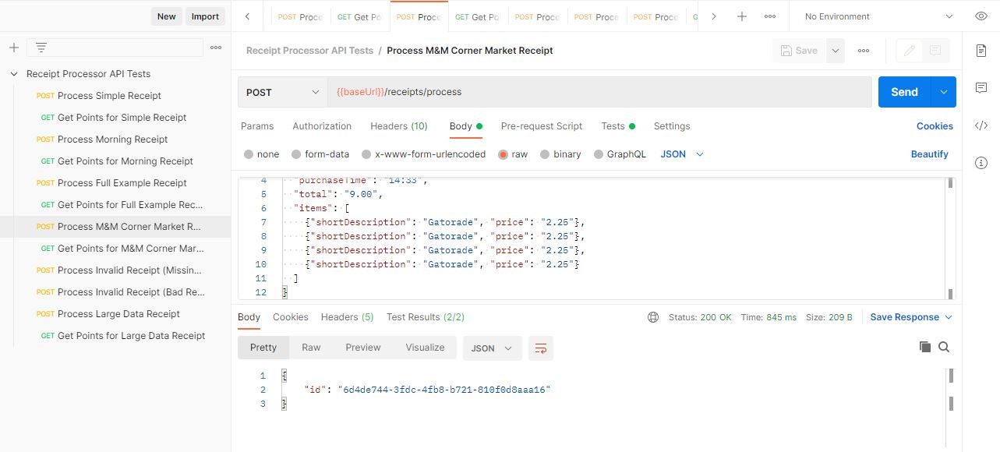

# Receipt Processor

Receipt Processor is a Go Lang based web service that processes receipt data and awards points based on specified
rules. The service exposes two API endpoints:

- **POST** `/receipts/process`: Accepts a JSON payload representing a receipt, validates it, calculates points, and
  returns a unique ID for the receipt.
- **GET** `/receipts/{id}/points`: Retrieves the calculated points for a stored receipt by its unique ID.

This project is designed to be lightweight, uses in-memory storage (non-persistent), and includes a simple main-method
based test runner (without JUnit) for verifying functionality—including tests with large data inputs.

## Table of Contents

- [Features](#features)
- [Requirements](#requirements)
- [Setup and Installation](#setup-and-installation)
- [API Endpoints](#api-endpoints)
- [Docker Setup](#docker-setup)
- [Running Postman JSON Script](#running-postman-json-script)

## Features

- **RESTful API** built with Go Lang.
- **Points calculation logic** based on specific business rules.
- **In-memory data storage** (data does not persist on restart).
- **Built-in test runner** (without JUnit) using a main method to output PASS/FAIL results.
- **Docker-ready** for containerized deployment.

## Requirements

- Go Lang latest version
- Docker (optional, for containerized deployment)

## Setup and Installation

1. **Install Go (Golang)**

To run the application, you need to have Go installed on your machine. Follow these steps:

- **Linux/Mac**: Follow the official guide: [Installing Go on Linux/Mac](https://golang.org/doc/install)
- **Windows**: Follow the guide here: [Installing Go on Windows](https://golang.org/doc/install#installing_on_windows)

You can verify the installation by running the following command in your terminal:
> go version

- **Install VCode**:
- **Install Go Plugin**: 

   ```
2. **Clone the repository:**

   ```bash
   git clone <repository_url>
   cd <repository_directory>
   ```

### 1. Running Normally

```bash
go the root folder /receipt_processor
go run main.go 
```

The service will be available on port **8080** by default.

### 2. Running Tests

Install testify package

```bash
go the root folder /receipt_processor
go get -u github.com/stretchr/testify 
go test -v ./tests/receipt_handler_test.go
```

## API Endpoints

### Process Receipt

- **Endpoint:** `POST /receipts/process`
- **Description:** Accepts a JSON payload representing a receipt, validates it, calculates the points, and returns a
  unique receipt ID.
- **Example Request:**

  ```json
  {
      "retailer": "Target",
      "purchaseDate": "2022-01-02",
      "purchaseTime": "13:13",
      "total": "1.25",
      "items": [
          { "shortDescription": "Pepsi - 12-oz", "price": "1.25" }
      ]
  }
  ```

- **Example Response:**

  ```json
  { "id": "7fb1377b-b223-49d9-a31a-5a02701dd310" }
  ```

### Get Points

- **Endpoint:** `GET /receipts/{id}/points`
- **Description:** Returns the number of points awarded for the receipt with the given ID.
- **Example Response:**

  ```json
  { "points": 31 }
  ```

## Docker Setup

To run the application in a Docker container, follow these steps:

1. **Create a Dockerfile** (if not already provided):

   ```dockerfile
    FROM golang:1.23 AS builder

    ENV CGO_ENABLED=0 GOOS=linux GOARCH=amd64

    WORKDIR /app

    COPY go.mod go.sum ./
    RUN go mod download

    COPY . .

    RUN go build -o main . && ls -lah main

    FROM alpine:latest

    WORKDIR /root/

    RUN apk add --no-cache ca-certificates

    COPY --from=builder /app/main .

    RUN chmod +x main && ls -lah main

    EXPOSE 8080

    CMD ["./main"]

   ```

2. **Build the Docker image:**

   ```bash
   docker build -t receipt-processor .
   ```

3. **Run the Docker container:**

   ```bash
   docker run -p 8080:8080 receipt-processor
   ```

The service will be available on port **8080**.

## Running Postman JSON Script

## Prerequisites

Ensure you have **Postman** installed on your system.

### 1. Install Postman

- Download and install Postman from [here](https://www.postman.com/downloads/).
- Follow the installation steps based on your OS.

## Running the Postman JSON Script

### 2. Load the JSON File

- Open **Postman**.
- Click on **File** → **Import**.
- Select the provided JSON file and import it.

### 3. Run POST Request

- Loan postman collection json
- Click Import and select from machine
- Make sure application is up and running either using manually or using docker
- Now you are good to run the test cases through postman

### 4. Example

- Click on "Process Simple Receipt"
- Request Body is already added just need to click on the "Send" button
- It returns a valid response with id
- Now Click on the next request, above id will automatically set
- It will return a required points for the id

- Request 
- Response 


 